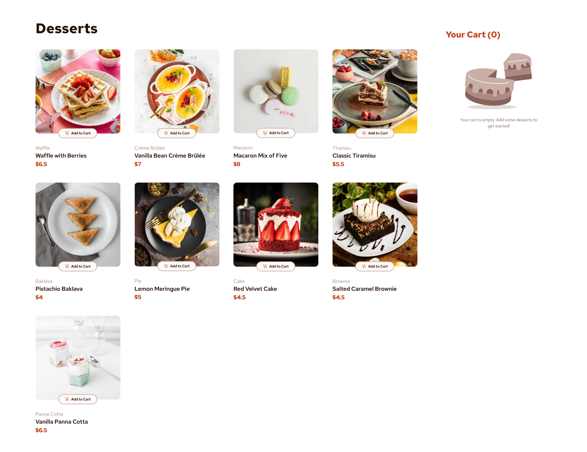

# Product List with Cart

This project is a frontend implementation of a product list with a cart functionality. It is built using HTML, CSS, and JavaScript.

## Table of Contents

- [Overview](#overview)
- [Features](#features)
- [Technologies Used](#technologies-used)
- [Setup](#setup)
- [Usage](#usage)
- [Screenshots](#screenshots)
- [Contributing](#contributing)

## Overview

This project showcases a product list where users can add items to their cart. The cart functionality includes viewing the cart, updating quantities, and removing items.

## Features

- Display a list of products
- Add products to the cart
- View the cart with added products
- Update product quantities in the cart
- Remove products from the cart

## Technologies Used

- HTML
- CSS
- JavaScript

## Setup

To run this project locally, follow these steps:

1. Clone the repository:
    ```sh
    git clone https://github.com/abhi-zero/product-list-with-cart.git
    ```
2. Navigate to the project directory:
    ```sh
    cd product-list-with-cart
    ```
3. Open `index.html` in your browser to view the project.

## Usage

- Browse the product list.
- Click on the "Add to Cart" button to add a product to the cart.
- Update quantities or remove items from the cart.

## Screenshots


*Screenshot of the product list.*


*Screenshot of the cart.*

## Contributing

Contributions are welcome! Please fork the repository and create a pull request with your changes.
